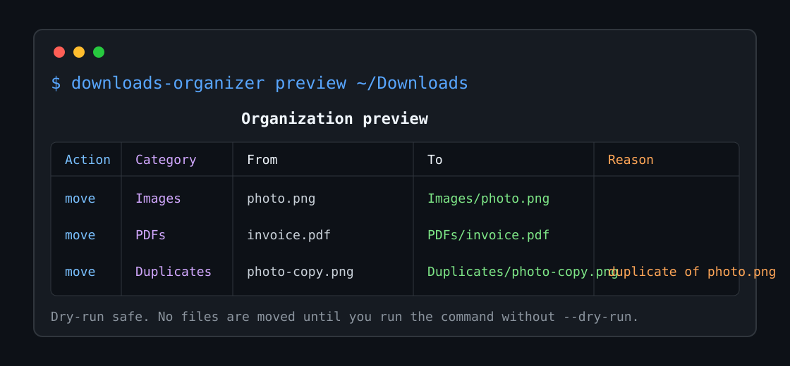
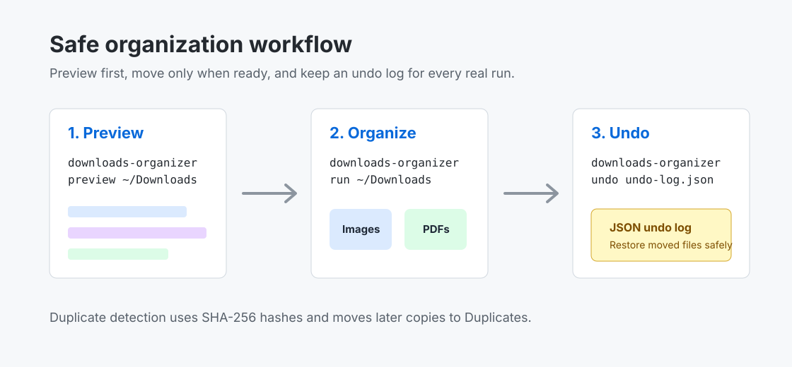

# downloads-organizer

[](https://github.com/jannis793/downloads-organizer/actions/workflows/ci.yml)
[](https://www.python.org/)
[](LICENSE)

A cross-platform Typer and Rich CLI that organizes messy Downloads folders by file type, with dry runs, preview tables, duplicate detection, date-based renaming, TOML configuration, and undo logs.



## Features

- Organize Downloads or any folder into Images, Documents, Videos, Audio, Archives, Code, PDFs, Spreadsheets, Installers, and Others.
- Preview every move in a Rich table before touching files.
- Use `--dry-run` for safe no-write execution.
- Detect duplicate files by SHA-256 content hash and move later copies to `Duplicates`.
- Prefix moved files with their modified date using `--date-rename`.
- Write JSON undo logs for every real run.
- Customize categories and defaults with TOML.
- Runs on macOS, Windows, and Linux.

## Install

```bash
pipx install downloads-organizer
```

For local development:

```bash
git clone https://github.com/jannis793/downloads-organizer.git
cd downloads-organizer
python -m venv .venv
source .venv/bin/activate
python -m pip install --upgrade pip
python -m pip install -e ".[dev]"
```

On Windows PowerShell, activate with:

```powershell
.\.venv\Scripts\Activate.ps1
python -m pip install --upgrade pip
python -m pip install -e ".[dev]"
```

## Usage

Preview your default Downloads folder:

```bash
downloads-organizer preview
```

Preview a specific folder:

```bash
downloads-organizer preview ~/Downloads
```

Organize a folder:

```bash
downloads-organizer run ~/Downloads
```

Run safely without moving files:

```bash
downloads-organizer run ~/Downloads --dry-run
```

Scan nested folders and date-prefix moved files:

```bash
downloads-organizer run ~/Downloads --recursive --date-rename
```

Undo a previous run:

```bash
downloads-organizer undo ~/Downloads/.downloads-organizer/undo-20260601-101530.json
```

Show the default config location:

```bash
downloads-organizer config-path
```

## Configuration

Create a TOML file at the path printed by `downloads-organizer config-path`, or pass one with `--config`.

```toml
target = "~/Downloads"
dry_run = false
recursive = false
date_rename = true
duplicate_detection = true
others_name = "Others"
ignore_names = [".DS_Store", "Thumbs.db"]

[categories]
Images = [".jpg", ".jpeg", ".png", ".gif", ".webp", ".svg"]
Documents = [".doc", ".docx", ".txt", ".rtf", ".odt", ".md"]
Videos = [".mp4", ".mov", ".avi", ".mkv", ".webm"]
Audio = [".mp3", ".wav", ".flac", ".m4a"]
Archives = [".zip", ".tar", ".gz", ".7z", ".rar"]
Code = [".py", ".js", ".ts", ".html", ".css", ".json", ".yaml"]
PDFs = [".pdf"]
Spreadsheets = [".xls", ".xlsx", ".csv", ".ods"]
Installers = [".dmg", ".pkg", ".exe", ".msi", ".deb", ".rpm"]
```

## Safety Model

`downloads-organizer` never deletes files during organization. It moves files into category folders, avoids overwriting existing names, and records every successful move in an undo log. Duplicate detection compares file contents, not just file names.

## Development

```bash
python -m pip install --upgrade pip
python -m pip install -e ".[dev]"
ruff check .
pytest
```

## Workflow



## Contributing

Issues and pull requests are welcome. Please read [CONTRIBUTING.md](CONTRIBUTING.md) before opening a PR.

## License

MIT. See [LICENSE](LICENSE).
